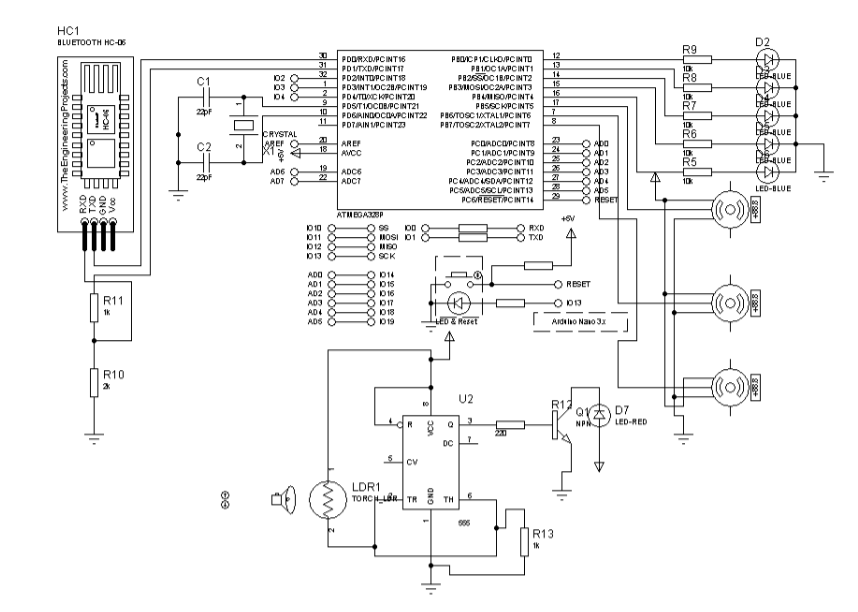

# Home Automation Using Bluetooth Interface


---

# Project Overview

The project designs a **prototype bluetooth control home automation system** that enables user to control the prototype home from an applications on an adriod device using bluetooth interface and also automatic light system that turns on in the dark.
---

#  Table of Contents

- [Features](#-features)
- [Objectives](#-objectives)
- [System Architecture](#-system-architecture)
- [Technologies & Components Used](#-technologies--components-used)
- [Working Principle](#-working-principle)
- [Circuit Diagram](#-circuit-diagram)
- [Installation](#-installation)
- [Usage](#-usage)
- [Project Structure](#-project-structure)
- [Project Images](#-project-images)
- [Testing](#-testing)
- [Challenges Faced](#-challenges-faced)
- [Results](#-results)
- [Applications](#-applications)
- [Future Improvements](#-future-improvements)
- [Contributing](#-contributing)
- [Author](#-author)
- [License](#-license)

---

# Features

- Bluetooth-based wireless communication
- Remote control of home appliances
- Automatic security light activation in darkness
- Energy-efficient smart home prototype
- Improved home security system
- Simple and user-friendly operation

---

# Objectives

- To design a smart home automation prototype
- To implement wireless appliance control
- To improve home security using automation
- To reduce manual operation of appliances
- To demonstrate the use of embedded systems in smart homes

---

# System Architecture

The system consists of:

- Arduino Uno / ATmega328P microcontroller
- HC-05 Bluetooth module
- LDR sensor
- LEDs and appliances
- Servo motor
- Mobile device for wireless control


---

# Technologies & Components Used

## Hardware Components
- Arduino Uno / ATmega328P
- HC-05 Bluetooth Module
- LDR Sensor
- Servo Motor
- LEDs
- Breadboard
- Jumper Wires
- Power Supply

## Software
- Arduino IDE
- Bluetooth Terminal Application

---

#  Working Principle

1. The mobile phone connects to the HC-05 Bluetooth module.
2. Commands are sent wirelessly through Bluetooth.
3. Arduino receives and processes the commands.
4. Connected appliances respond based on the received command.
5. The LDR sensor detects darkness automatically.
6. Security lights turn on when low light intensity is detected.

---

# Circuit Diagram

The diagram below shows the connection between the Arduino board, Bluetooth module, sensors, and output devices. The circuit diagram is designed with output to two extra servor motor bacause of future improvements to the prototype and but one servo motor was used to reduce cost

# images





---

# Installation

## Requirements

- Arduino IDE
- Arduino board
- HC-05 Bluetooth module
- Android phone with Bluetooth support

## Setup Instructions

1. Clone the repository:

```bash
git clone https://github.com/CLOUDMAN792/design-and-construction-of-a-prototype-home-automation-using-Bluetooth-interface.git


2. Open the Arduino code in Arduino IDE.

3. Connect the Arduino board to your computer.

4. Upload the code to the Arduino board.

5. Pair your phone with the HC-05 Bluetooth module.

6. Open a Bluetooth controller app and begin controlling the system.

---

#  Usage

- Connect your mobile device to the HC-05 Bluetooth module.
- Send commands through the Bluetooth app.
- Appliances respond according to the command sent.
- The automatic security light works independently using the LDR sensor.

---

# Project Structure

```bash
Home-Automation-Bluetooth/
│
├── Arduino_Code/
│   └── home_automation.ino
│
├── Images/
│   ├── front-page.png
│   ├── block-diagram.png
│   ├── circuit-diagram.png
│   └── prototype.jpg
│
├── README.md
└── documentation.pdf
```

---

# Project Images

## Prototype Design


## Hardware Setup


---

# Testing

# Testing and report 

Turn off the switch of the prototype home automation
Turn on the bluetooth of your andriod phone
search for new bluetooth device from your andriod phone . you will find a bluetooth device with the name HC-05
Click on the connect/pair device option. The default pin for HC-05 is 1234 or 0000
After connceting to bluetooth module HC-05, open the home automation app on the andriod phone
Click connect to Arduino . after few seconds the app connects to the Arduino
Then the user can turn on/off the toilet , sitting room and dinning room, kitchen and bedroom light by clicking on each and every room's off and on button
the door can be opened by clicking on the door open button and closed by the door close button 
The user can disconnect the bluetooth by clicking the disconnect Arduino in the app


---

#  Challenges Faced

# Challenges encountered 

when the construction of the project started, PIC16F690 was first used which the PIC does'nt support serial communication when using MIKROC IDE. Then, the PIC was changed to PIC16F887A which works fine and perfect with the project but it is big and expensive, so i had to leave it and pick another IC.
Then i decided to use Arduino for the project. Arduino has an IC whuch is ATMEGA320P . 
 Desiging the application that should work for both Andriod am Ios which is very difficult to achieve at my own present knowledge. Therefore my application is rooted to andriod phones only. only adriod phones can communicate with the design.

The construction has other numerous difficulties during construction process. some of the difficulties are : 
- Getting the required electronic component for the construction of the project.
- Getting the microcontroller to use for this project is a little difficult . Many micro-controllers of different models were used and before i could finalize on a particular micro-controller , time was not on my side. 
- Different circuit is being constructed for each micro-controller used. this is a serious issue which cost time , money and energy. Well , it gave me more experience in research works.
- lastly the voltage regulator bought for the project failed after testing the second time . so a dc to dc bulk was used to replace it . A single servo motor was used instead of three to reduce cost and also battery of 9v with higher current rating was later used to replace the formal battery.

---

# Results

The project successfully achieved:

- Wireless control of appliances. 


- Automatic security lighting

- Smart home automation functionality

- Improved convenience and efficiency

---

# Applications

- Smart homes
- Office automation
- Security systems
- Energy management systems
- Embedded systems learning projects

---

#  Future Improvements

- Add voice assistant support so users can control light doors and fan using speech like command 

- Develop a dedicated and advance app that can work for both andriod and ios to control the system

- wifi and inernet integration . upgrade the system in a way that it will be able to use wifi or iot control so users can operate appliances remotely from anywhere using internet

- Renewable energy integration like connecting the system to a solar system and smart battery monitoring
---


# Contributing

Contributions are welcome.

To contribute:

1. Fork the repository
2. Create a new branch
3. Make your changes
4. Submit a pull request

---

# References

- Arduino Official Documentation
- HC-05 Bluetooth Module Datasheet
- Embedded Systems Design Materials

---

# Acknowledgements

Special thanks to my supervisor, lecturers, and colleagues who contributed to the success of this project.

---

#  Author

## OLANIRAN OLAWALE EMMANUEL

- GitHub: https://github.com/cloudman792
- Email: olamiran.emmanuel15@gmail.com

